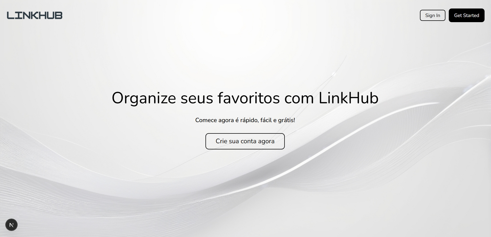

# LinkHub 🔗

> Plataforma para usuários adicionarem, gerenciarem e categorizarem seus links favoritos, com opções de edição, exclusão, compartilhamento e filtro por categoria.

O **LinkHub** é um projeto em desenvolvimento feito com **Next.js 15 (App Router)** que visa oferecer uma solução simples e moderna para organizar links, categorizá-los e compartilhá-los de maneira prática.

Este projeto está sendo desenvolvido para consolidar meus conhecimentos em **full stack moderno**, utilizando autenticação, gerenciamento de links, categorias e integração entre frontend e backend com tecnologias atuais.

---

## 🚀 Tecnologias

* **Next.js 15 (App Router + Server Actions)**
* **TypeScript**
* **MongoDB + Mongoose**
* **NextAuth.js (autenticação)**

---

## 💻 O que estou aprendendo e construindo

### 🧠 Backend com Next.js e MongoDB

* **Criação de rotas server-side com App Router**, aproveitando as novidades do Next.js 15 para APIs e Server Actions.
* **Modelagem eficiente do banco de dados com MongoDB e Mongoose** para armazenar usuários e links favoritos com categorias.
* **Implementação de autenticação segura** com NextAuth para controle de acesso e gerenciamento de sessões.
* **CRUD completo de links**, permitindo adicionar, editar, deletar e organizar links por categoria.
* **Normalização de dados antigos e integração de categorias**, garantindo compatibilidade com links previamente adicionados.

### 🎯 Frontend com Next.js

* **Construção de interface moderna e responsiva** para fácil navegação e uso dos recursos.
* **Formulários controlados** para adicionar links e definir categorias.
* **Exibição e filtro de links por categoria**, tornando a experiência mais organizada.
* **Botões de compartilhamento e edição inline**, para melhor interação do usuário.
* **Integração em tempo real com backend**, possibilitando atualização imediata dos links e categorias.

---

## 📲 Funcionalidades (em desenvolvimento)

* Cadastro e login de usuários com autenticação segura.
* Adição, edição e exclusão de links favoritos.
* Definição e edição de categorias para cada link.
* Filtro de links por categoria.
* Compartilhamento de links diretamente da plataforma.
* Dashboard simples e intuitivo para visualização de todos os links e suas categorias.
* Interface otimizada para desktop e mobile.

---

## 📝 Observações

O **LinkHub** ainda está em desenvolvimento, mas já representa um avanço importante na minha jornada como desenvolvedor full stack. A aplicação explora os recursos mais recentes do **Next.js 15**, unindo backend e frontend em um único projeto moderno, com foco em organização, experiência do usuário e escalabilidade.

---

## 📨 Contato

📧 [guilhermemillerblack@gmail.com](mailto:guilhermemillerblack@gmail.com)

---